# 3DTransform
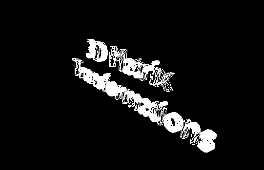

A C/C++ 3D matrix transformation experiment

---

# Math and data estructures

## Vectors and matrices
Vectors are **floating point 128bit SSE registers** (pratically a array of 4 floats)
and matrices are an array of 4 vectors. Most operations are done with Intel intrisics 
while some others are not (like **vector cross product**). 
Matrices are implemented using **row-major** in order to facilitade use of 
intrinsics and memory layout. Although SIMD is not really used in this instance, the 
fact that the vectors are an SSE type they can be used to do all kinds of vector 
processing before the matrix transformations.

---

## Model transformations
There is **translation**, **scale** and **rotation** on the 3 basis vectors.

### Translation 

#### Translate X
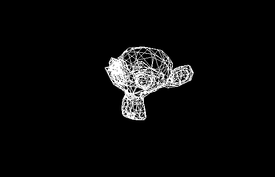

#### Translate Y
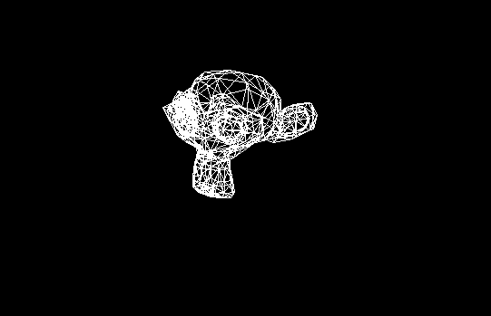

#### Translate Z

---

### Scale

#### Scale X
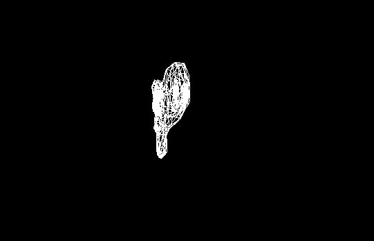

#### Scale Y
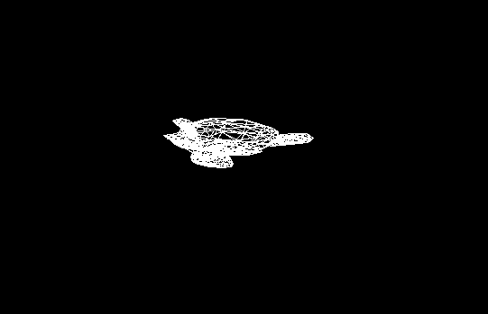

#### Scale Z
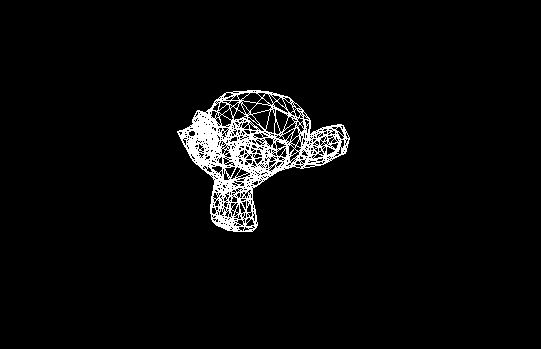

---

### Rotation

#### Rotate X
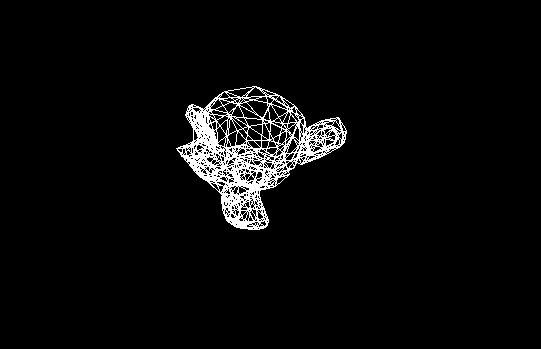

#### Rotate Y
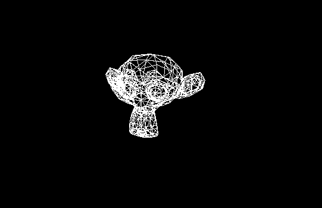

#### Rotate Z
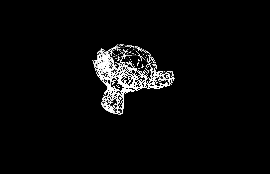

---

## View matrix

The view matrix is contructed with a Up, Position and Center vectors and is a 
Right Handed system.

## Projection matrix

The projection matrix is based on the OpenGL transformation matrix (more specifically 
the GLM implementation) and is constructed with the camera's vertical FOV, 
aspect ratio, near and far planes.

---

## More examples

Examples with (almost) everything in action. 

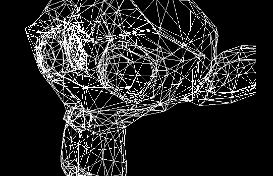
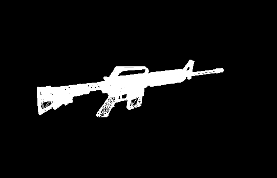
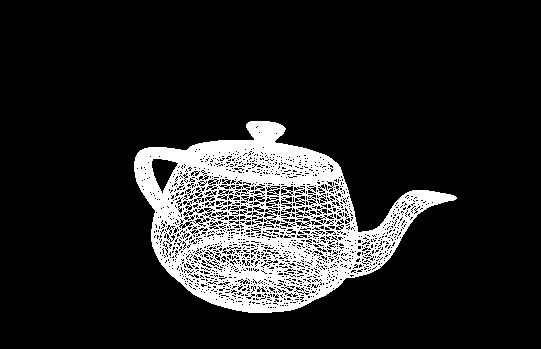

_The GIFs are laggy because of a issue on recording_
